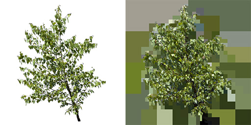
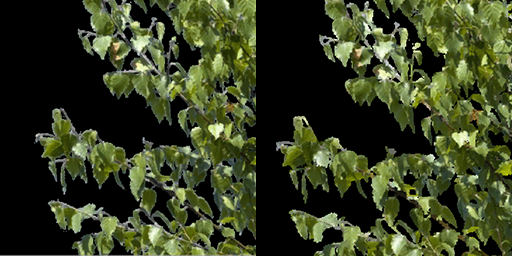
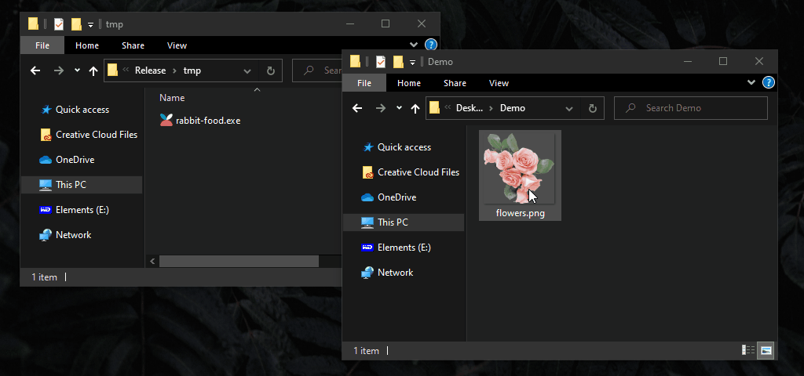

## Introduction

An implementation of what Sean Feeley called _mip-chain-texture-flood-filling_ in his 2019 GDC talk [Interactive Wind and Vegetation in 'God of War'](https://schedule2019.gdconf.com/session/interactive-wind-and-vegetation-in-god-of-war/860472). I was lucky enough to sit in the audience and think his proposed solution was pretty nifty.

Why is this needed? Foliage texture dilation is used to avoid color bleeding for foliage alpha cut-outs when game engines generate mip maps. Traditionally this is done by blurring the image a couple of times. Since convoluting with a gaussian kernel is kinda intense, the proposed solution is computational faster. Additionally, thanks to the rather unaesthetic color blodges RLE has a higher chance to do its thing when the image is compressed.

## Examples



Example of exported foliage saved as png from photoshop with alpha made visible on the left, same png after being processed by rabbit food on the right. What looks like a broken jpeg image is in fact the flood fill of the image. _Color mip maps_ are created by constantly halfing the size of the given image and keeping the color based on its alpha value.



Loaded into Unity engine as a alpha cutout texture. See the white edges of the left image. Filling the alpha channel with the correct colors prevents color bleeding.


## Usage

### Drag and Drop

Drag and drop a .png file onto the .exe application. A new .png with the original name and the suffix "\_fill" will be created in the same directory as the original file.




### Commandline

```
rabbit-food.exe inputpath.png [OUTPUT_FILE] [--help, -h] [--verbose, -v] \
[--overwrite, -o] [--resize=smaller|nearest|larger, -r]
```


Command | Description
--- | ---
**help** | print help
**verbose** | print status while computing
**resize** | "smaller", "nearest" or "larger" determines the behaviour if the imported image is non-power-of-two
**overwrite** | if the output path already exists, overwrite file or find next incremental name


## Limitations

This method relies on the dimensions of the image being power-of-two (32, 64, 128, 256, 512,...). The dimensions do not have to be identical. An image with 32px x 1024px is perfectly legal.

Should the image not be power-of-two it will be resized based on the input settings and the output image will have the new dimensions.


## License
You may find the licenses of the used libraries in their respective directories. Do with the code and binary release of my tool as you will. It would make my day if you sent me a mail what you did with it. Don't hesitate to reach out in case you encounter any bugs or need additional functionality.
