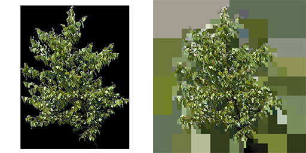
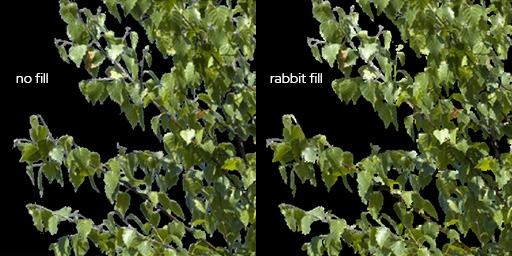
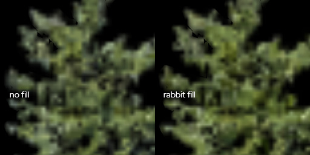

## Introduction

An implementation of Sean Feeley's mip chains texture flood-filling approach from his 2019 GDC talk [Interactive Wind and Vegetation in 'God of War'](https://schedule2019.gdconf.com/session/interactive-wind-and-vegetation-in-god-of-war/860472) which I was lucky enough to attend.

Foliage texture dilation is used to avoid color bleeding for foliage alpha cut-outs when game engines generate mip maps. Traditionally this was done by blurring the image a couple of times. The proposed solution is computational faster and has a higher compression rate.

## Examples



Example of exported foliage saved as png from photoshop with alpha made visible on the left, same png after being processed by rabbit fill on the right.



Loaded into Unity engine as a alpha cutout texture. See the white edges of the left image. Filling the alpha channel with the correct colors prevents color bleeding.



Loaded into Unity engine and creating automatic mip maps. See the colors on the edges bleeding into white on the left image.


## Usage

### Drag and Drop

Drag and drop a .png file onto the .exe application. A new .png with the original name and the suffix "\_fill" will be created in the same directory as the original file.


### Commandline

```
rabbit-food.exe inputpath.png [OUTPUT_FILE] [--help, -h] [--verbose, -v] \
[--overwrite, -o] [--resize=smaller|nearest|larger, -r]
```


Command | Description
--- | --- 
**help** | print help
**verbose** | print status while computing
**resize** | "smaller", "nearest" or "larger" determines the behaviour if the imported image is non-power of two
**overwrite** | if the output path already exists, overwrite file or find next incremental name


## Limitations

This method relies the dimensions of the image to be power of 2 (32, 64, 128, 256, 512,...). The dimensions do not have to be identical. An image with 32px x 1024px is perfectly legal.

Should the image not be power of two it will be resized based on the input settings and the output image will have the new dimensions.


## License
You may find the licenses of the used libraries in their respective directories. Do with the code and binary release of my tool as you will. It would make my day if you sent me a mail what you did with it. Don't hesitate to reach out in case you encounter any bugs or need additional functionality.
